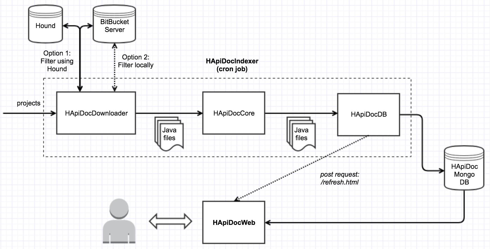

## Overview
HApiDocIndexer is the downloader/indexer behind HApiDoc.

## What is HApiDoc?
HApiDoc builds on top of [CLAMS](https://mast-group.github.io/clams/) and provides a way to find and show examples on how to use some source code in project X based on similar usages in project Y.

The rationale behind HApiDoc is that running CLAMS in an enterprise environment with a large number of projects is not straightforward for the following reasons:
 
- In order to run CLAMS someone needs to install several dependencies which are OS-specific.
- Collecting the data that will be used as the service’s input is a manual and time-consuming task.
- Results are stored in local files and there is no web interface to present them to the users.
- The service does not integrate with any Git hosts to allow easier data collection or exploration of the results.
- There is no automation around running CLAMS; the user needs to manually run the service every time he/she wants to generate usage examples for a library.

The purpose of HApiDoc is to provide a set of components that cover the above limitations and to orchestrate any required tasks with the aim of providing an end-to-end solution for mining and presenting API usage examples to the users.

### HApiDoc Architecture
HApiDoc consists of 2 main components that run as Docker containers:
- HApiDocIndexer: This component aims to create the dataset that will be used from CLAMS, apply CLAMS on the dataset and store the results in MongoDB.
- HApiDocWeb: This is the web service for HApiDoc. It shows results on a neat web page.



## HApiDocIndexer
HApiDocIndexer consists of 3 main sub-components and aims to create the dataset that will be used from CLAMS (HApiDocDownloader), apply CLAMS on the dataset (HApiDocCore) and index the results (HApiDocDB).

### Input
The main input of the HApiDocIndexer component is a key-value Python dictionary which contains the following info for every project we'd like to generate usage examples:

- The name of the project as the key
- The BitBucket Server key of the project
- The package name of the project

An example is shown below:
```
{'repository1':
    {
     'package': 'base-package1',
     'repo': 'project1/repository1'
    },
 ...,
 'repositoryn':
    {
     'package': 'base-packagen',
     'repo': 'projectn/repositoryn'
    }
}
```

## HApiDocDownloader
### Input
HApiDocDownloader receives the following info (through the key-value dictionary):

- A list of repos for which we're generating API usage examples (APIs).
- The mapping between each API and its fully qualified name on BitBucket Server (e.g. "repository1": "project1/repository1").
- The mapping between each API and its associated package name (e.g. "repository1": "base-package1").

### Output
It then outputs, for each API:

- A list of Java files that call the API (Client Files).
- A json file that contains useful info about the java files. This includes their repo's name, their project's name, their full path on BitBucket Server, etc.

### How it works
HApiDocDownloader creates the dataset that will be passed as an input to CLAMS by downloading and filtering the client source code which is called in your target libraries. The service currently supports 2 modes for downloading and filtering files:

1. The [NaivePreprocessor](hapidocdownloader/NaivePreprocessor.py) can be used to create the dataset for CLAMS by cloning any repositories available at your BitBucket Server instance and filtering locally.
2. In case [Hound](https://github.com/etsy/hound) has been set up to index your BitBucket repositories, you can use the [HoundPreprocessor](hapidocdownloader/HoundPreprocessor.py) which will crawl Hound's API to create a filtered dataset. This way you don't need to clone the repositories and Hound will be used for filtering.

## HApiDocCore
### Input
HApiDocCore receives the following info (through the key-value dictionary and from HApiDocDownloader):

- A list of repos for which we're generating API usage examples (API).
- A mapping between the API and its associated package name (e.g. "repository1": "base-package1").
- A list of Java files that call the API (Client Files) from HApiDocDownloader.

### Output
It then outputs, for each API:

- A summarised version for each Java file (Snippet)
- A json file containing info about each Snippet (*ranked_files.json*). This includes its filename, the client method where an API method is called, a list of API methods that are called in the Snippet, and its support
- A json file containing the association between any API method and its callers (Snippets)

### How it works
HApiDocCore applies CLAMS on the dataset created by HApiDocDownloader. It uses the Naive clustering algorithm that will only cluster snippets with identical API call sequences together.

Briefly, the process followed by CLAMS is explained below:
- The system generates a list of API call sequences from each client method, while it also generates the Abstract Syntax Trees (ASTs) of the client files.
- It then retrieves the source code files that are associated with the sequences extracted before, and generates a summarised snippet for each of them, using a simple summarisation algorithm.
- It computes a "support" value for each generated snippet, based on the API methods it calls.

## HApiDocDB
### Input
HApiDocDB receives the following as an input:

- A list of repos for which we're generating API usage examples (API).
- All files produced by HApiDocCore

### How it works
Thi component uses the output produced by HApiDocIndexer to produce documents which are then stored in MongoDB.

## How to run
HApiDocIndexer can be run using Docker. You can either run vs a remote mongodb and a host on which HApiDocWeb is already running or using a linked mongodb (for testing purposes).

### Running (vs remote MongoDB)
This will store all data to the mongo host (MONGO_DB_HOST) provided in [docker-compose.yml](docker-compose-with-linked-mongo.yml).

```
docker-compose build
docker-compose up
```

### Running (vs local MongoDB)
This will make use of a linked mongodb container that's running locally.

```
# Spin up mongo
docker run -d -p 27017:27017 --name mongo mongo:latest 
docker-compose build
docker-compose -f docker-compose-with-linked-mongo-container.yml up
```

### Notes
*Note*: In case you use the provided crontab  file, make sure you modify the time in this file appropriately in order for the scripts to run.

*Note*: Make sure you have modified the docker-compose file you're using appropriately.

*Note*: To be able to test the post request (*/refresh*) you need to be run HApiDocWeb as well.

## Contact
If you would like to ask any questions about or discuss HApiDOC please contact [a member of the project team](https://github.com/orgs/HotelsDotCom/teams/hapidoc-committers/members).

## Credits
Created by [Nikos Katirtzis](https://github.com/nikos912000) with thanks to  [Elliot West](https://github.com/teabot), [Jose Nuñez Izu](https://github.com/jmnunezizu), Miguel Novais Pimenta, and [Tom Wilkinson](https://github.com/https://github.com/wilkotom).

## Legal
This project is available under the [Apache 2.0 License](http://www.apache.org/licenses/LICENSE-2.0.html).

Copyright 2018 Expedia Inc.